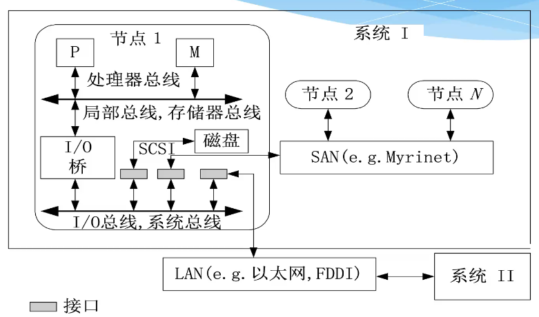

- 并行计算历史
  -  FLOPS：Floating-point operations per second
- 系统互连
  - 总线、局域网
  - 
  - SAN: Storage Area Network
  - P 是处理器，M 是内存
- 网络性能指标
  - 节点度（单向图就是出度入度之和）
  - 网络直径：最远两个点的距离
  - 对剖 bisection 宽度：对分要切掉的最少边数
  - 对剖带宽：跑在在对剖平面上的数据量（位 / 字节）
  - 对称：从任意节点看网络都一样
- 静态互联网络：连接保持不变，带宽高但是成本高
  - 动态网络：可以开关连接，相反
  - 静态 vs 动态 e.g. 立交桥 vs 红绿灯

### 静态互联网络