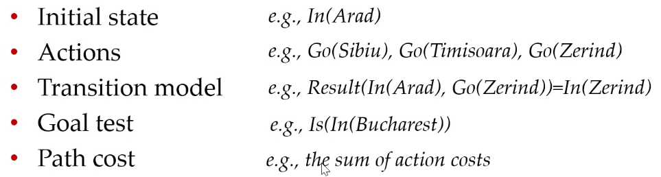
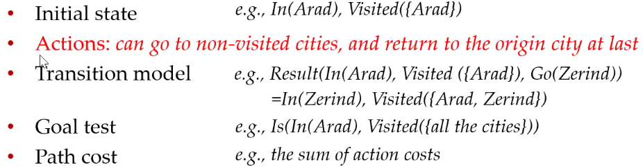
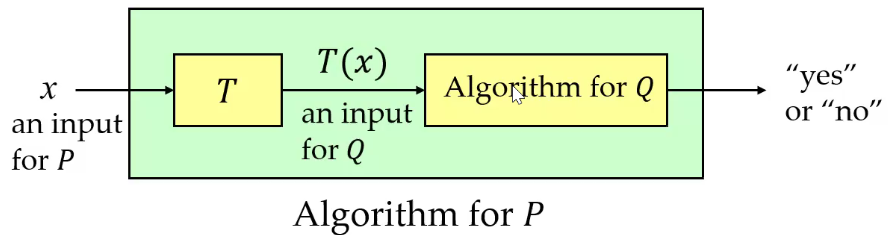

### Search Problem

- 定义一个搜索问题需要 5 个 component

	

	- solution, optimal solution
	- e.g. TSP，每个城市访问 == 1 次

### Complexity Classes

- P, NP, NP-complete, NP-hard（都是针对 decision problem
	- P：solved in 多项式时间 with 确定算法
		- 非确定算法：generate & test，成功就输出
	- NP：如果理应是正确的，则在某次运行应该在多项式时间内输出 yes
		- 证明 $P\subseteq NP$：test 的时候直接和正解比较
	- 多项式规约：用多项式时间把问题 A 的输入转换成为标题 B 的输入并且等价
		- 
- decision problem: 输出 $\in$ {0, 1}
	- optimization problem
	- 转换成 decision problem：尝试不同最小值、二分（？