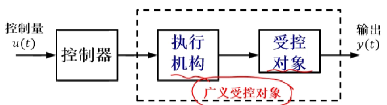

### 引言

- 控制：使受控对象按照预期的方式工作
	- 输入：激励
	- 输出：响应
	- 受控对象
		- 共性特点：动，用微分方程刻画
- 自动控制：无人参与情况下，使受控对象产生预期响应

### 自动控制简史

- 前期控制 - 1900 - 经典控制 - 1950 - 现代控制
- 1766 瓦特 离心式调速器
	- 1868 Maxwell 微分方程模型，论调节器
	- 这一堆人自己看 ppt
- 经典控制理论下的控制工程 1950s成熟
	- 传递函数
	- 频域法、根轨迹法，SISO
- 现代控制理论
	- 状态空间 
	- MIMO，非线性，时变

### 自动控制应用

- 数控机，磁悬浮列车，无人驾驶汽车、飞机，转台，机器狗，人造卫星

### 自动控制的基本概念

- 控制
- 受控对象
	- 受控变量：速度、转向角度、温度……
- 自动控制
- 控制系统
- 控制系统框图
	- 
- 开环控制：信息单向流动
	- 闭环控制：信息的双向流动
- 反馈：是控制的精髓
	- 正反馈
	- 负反馈
- 基本性能要求
	- 稳定性、快速性、准确性
- 控制工程的基本流程
	- 