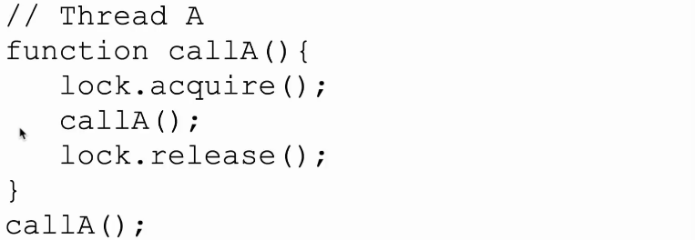

# 同步 Synchronization

- 互斥：保证两个线程不能执行同一段代码
- 并发程序的模型：类似于马**尔科夫链，有可能往多个方向走
- 检查代码能否并发运行：在代码中间随便瞎吉儿插入别的神秘代码，还能正常运行
	- 状态机视角就是随便游走的时候某一个分支会出错（可以用来证明正确性）
	- 有自动化模型检查器

## 临界区 Critical Section

- 一段代码，会访问一段共享的资源
- 这个区里面的代码不应该同时读写数据
- 四个条件
	- **两个进程不能同时进临界区（safety）**
	- 不能对计算速度作出假设
	- 不在临界区里的进程不能阻塞其他进程
	- **进程不能一直等着进不了临界区（liveness）**

## Implementation - busy waiting

- busy waiting 的意思就是搞个死循环来等

### 关中断（x

- 暴力做法：进临界区就关中断，出去了再开
	- 关了中断理论上 CPU 就没有办法打断执行给别的进程
- 不太好，关了中断系统就不能提供一些服务
	- 进程也可能陷入死循环，直接寄了

### 锁变量（x

- 不行，因为锁变量还得要一个锁变量来锁它，。。。

### 严格轮转 Strict Alternation

- 如果 p0 的非临界区代码跑得太慢，会阻塞 p1，违背了临界区第三个准则

### Peterson's solution

![[attachments/Pasted image 20220415112200.png]]
- 要进临界区：先举手，然后往门上贴一个对方的号码。 ^e69591
	- 如果门上的号码不是自己并且对方举手就不能进去
	- 本质上还是谁手快谁先进
- 不会违背第三条原则，因为离开临界区后手放下了，另一个人就可以进了

- 以上都是软件实现，开销较大；可以用硬件实现：

### TSL Instruction

- test and set lock
- ![[attachments/Pasted image 20220415113434.png]]
- 这是个原子指令，其他指令动不了它；执行过程中会锁死 memory bus，其它人访问不了
- ![[attachments/Pasted image 20220415113928.png]]
- 和锁变量的区别是：这里 tsl 指令是原子指令，执行中不会受到打扰
- 还有 XCHG （exchange）指令 as an alternative

### 问题：Priority Inversion

- busy waiting 的问题：在优先级调度情况下，低优先级进程在关键区里，但是高优先级进程来了，低优先级进程还没退出临界区就被踢出 cpu 了，并且不再被 shedule（因为有高优先级进程存在），高优先级进程永远运行不了
	- Priority Inversion：高优先级任务被低优先级任务卡住了
- solution：priority inheritance protocal 优先级继承协议
	- 允许一个任务继承被它阻塞的最高优先级任务的优先级

## Implementation - Sleep and Wakeup

### Producer-Consumer

- 当缓冲区满后就将生产者 sleep，否则就往缓冲区里写
	- 如果有空位再 wakeup
- 当缓冲区空后就将消费者 sleep，否则就从缓冲区里读
- 
- 这是不对的，会有条件竞争：count 变量
	- 当 count = 0 时，consumer 刚将 count 读进寄存器就被系统调度扬了，选择调度 producer
	- producer 往里丢了一个东西，count = 1，然后唤醒 consumer
	- consumer 一醒过来，还认为 count 是 0，就睡了
	- producer 再过来将 count = 2，此时已经不会唤醒消费者了
- **本质上是不应该在 if 和 sleep 之间被切掉**

### 互斥锁 spin lock protect

- 其实就是用 TSL 指令
- 
- 也不对，因为 producer sleep 的时候别人无法解开锁
- 改进：
- 但是在 mutex_unlock 和 sleep 之间被切掉就寄了
- 关键问题是 上锁、sleep 这个操作应该是原子性的， **本质上是不应该在 unlock 和 sleep 之间被切掉**，所以要用：

### 条件变量 Condition Variable ✔

- 升级版的互斥锁
- 有三个成员函数：
	- `Wait(ConditionVariable *cv, Lock *lock)`：原子操作，让调用它的进程 sleep 并且释放锁
	- `Signal(ConditionVariable *cv)`：（随机）唤醒一个正在等待此条件变量的进程
	- `Broadcast(ConditionVariable *cv)`：唤醒所有在等待这个条件变量得进程
- 本质上就是原子化了 unlock sleep lock 这三个操作
- 用条件变量实现生产者 - 消费者问题
- 拓展到多个生产者 / 消费者？
- 使用注意点

### Linux: futex

- （直接系统调用）
- 有个问题：value 加到爆 int 就寄了（但是并不会经常发生

## Mutexes in Pthreads (POSIX)

- 

## 信号量 Semaphores

- 
- 如果为正，表示有多少可用的资源
- 如果为负，表示有多少线程在等待资源

### P V operation

- 
- 
	- empty 指空位的数量，full 指当前的数量（？
	- 锁和PV不能交换位置，不然就卡死在锁里面了，P不会释放锁
	- 这里的锁是为了锁 enter 和 produce item，而不是为了锁信号量的操作，信号量自带锁
- 也可以用 信号量来模拟锁
	- 
	- 二元信号量 mutex：要么是1要么是0

### Implementation

- 用 condition variable 实现信号量
- s 是个 semaphore 结构体
- 

### 将信号量用在 interrupt handler 上

- ？？
- 就是 IO 设备 V，要读的设备 P

## 同步原语

- 是指进程调用 signal 后的行为

### Monitor 管程

- 封装了同步操作，对进程隐蔽了同步细节，简化了同步功能的调用界面。不需要用户程序自己在那 P V
- 两个等待队列：
	- 管程入口处的等待队列
	- 管程内的资源等待队列：管程内有条件变量，会有进程阻塞在上面
- 
- 一些术语：
	- wait queue：等待某个信号量的进程
	- ready queue (entry queue)：可以进入的进程，已经可以被调度了
	- monitor 管程：在管程里就是在被执行，同时只能有一个进程在管程里运行（可能还有一些被阻塞了

### Hoare semantics✔

- 调用者立刻被暂停并且释放锁
- 某一个进程立即得到锁并且进 monitor 继续运行
- 调用者只有当其他进程 signal 它了之后才能继续执行下面的代码，即使是非临界区的代码也不能运行（也就是说在它看来 signal 函数一直不返回，直到子进程运行完了才返回
- 好处是：可以假设进程当暂停和继续的时候状态是完全一样的

### Brinch Hansen semantics

- 调用者立刻退出 monitor（准确地说是应该退出的时候再 signal，而 Hoare 可以先 signal 再退出
- 被 signal 者退出 wait queue 进入 ready queue
- signal 在调用者进程中必须是最后一句话

### Mesa semantics

- 被 signal 者从 wait queue 进 ready queue，但是如果被调度执行了可能会被阻塞，等之前的进程出来
- signal 者可以执行完所有的话直到退出 monitor 后面的程序才会进来执行
- 进程不会被暂停：要么 wait 要么退出 monitor
- 接受较广，Java、POSIX
- e.g. Java 关键字 synchronized
	- 只能有一个 reason，wait、notify 没有参数
	- 
	- 具体实现（？？

## 屏障 Barrier Synchronization

- 等待所有进程到某个点然后才继续做下去

### Implementation

- 
	- 用 leave_count = p, arrive_count = 0 标识初始状态
	- 最后的 leave_counter++：所有进程加过之后就变成 leave_count = p 的初始状态了

### POSIX API

- 

# Case Study

## 读者写者问题

- 很多人同时要读一个东西，或者同时写一个东西
- 读写锁：rwLock
- 互斥：任意两个写者之间、任意一个写者和所有读者之间
- 具体实现：
- 以下是逐步构造正确的写法 

## 如何实现 \*ShouldWait

### 两个愚蠢的做法

- 写者优先：读者必须等所有写者（无论正在写还是将要写）都写完才能读但是这样会导致读者被 starve（一直有写者过来
- 读者优先：镜像这样也会导致写者被 starve
- 
### 一个相对公平的做法

- 使用信号量，红色部分就是修改的部分这样的话当没有reader在跑的时候，其它reader跑不了，只有当有一个reader active大家才能一起读
	- 此时写 reader preferred 或者 writer preferred 效果是差不多的
- 能不能不用锁，因为锁会 spin，浪费资源

## Read-Copy-Update (RCU)

- 一边读一边写，Publish-Subscribe 机制，类似于操作链表，先创建节点好了直接改 next
- 插入：
- 删除：
- 改变：先创建新节点，然后什么时候改next？
	- 宽限期 Grace Peroid：直到最后一个读旧数据的读者走了的之后才更新next
	- 读：rcu_trad_lock() rcu_read_unlock() 实际上并没有真正锁住
- Limitations：
	- 数据太复杂时不适用（要改一堆指针
	- 宽限期可能会很长

## 哲学家吃饭问题

- 五个人，五把叉子，但是一个人吃饭要两把
- 每个哲学家思考一会 - 拿两个叉子 - 吃一会 - 放下叉子 - 重复

### 愚蠢的做法

- 死锁（即循环依赖），大家一起等右边的叉子

### 改进

- Starvation（并不是因为没有资源，而是因为没有合理调度）这样万一所有人同时开始执行就寄了
- Deadlock $\rightarrow$ Starvation, 反之不一定
- 改进：把 else 里的 Sleep(someTime) 改成 Sleep(randomTime)
- 正常是能用了，但是有些安全有关的地方不能浪费时间，也没有形式化验证

### 加锁

- 只有一个人加锁 
- 没有 deadlock，但是有可能有 starvation：有人运气不好会一直被 lock

### 表示状态

- 四个状态 思考 饿了（想吃） 在吃
- idea：叉子要拿就直接拿两个，分开拿容易死锁
- test 意思是检查能不能释放，如果左右都不在吃，那可以给自己的信号量 V 一下，就能释放了，能直接吃了

# Deadlock

- 死锁一般出现在不能抢占式资源上
	- 比如绘图仪、打印机（不然就乱了）、互斥锁、信号量
	
- 简单例子只要调一下顺序就可以了

- 死锁的（必要不充分）条件：
  1. 资源是互斥的
  
  2. 持有并等待：进程拿着一些资源，再在等另一些资源
  
  3. 不能抢占：进程是非抢占式的（不能被强占的
  
  4. 循环的等待条件
  
  - 实际上可以扩展：1. 资源是互斥的 $\rightarrow$ 同时访问一个资源的进程数量 $\le n$
  - 再看哲学家吃饭问题：
    - 算法 1 满足了 4 个条件
    - 算法 2 破坏了第二个条件
  - 为啥是不充分的：
    - 在一个循环等待条件中，可能由外部的进程释放了资源导致循环里的一个进程得到了资源，就跑起来了
  
- 奇怪的递归锁

### 资源分配图

- 用有向图来表示死锁
  - ⚪ 表示进程
  - ⬜ 表示一种资源
	  - 框里的点⚫表示好多个同种资源
  - ⚪$\rightarrow$⬜ 表示进程等待资源
  - ⚫$\rightarrow$⚪ 表示资源被进程持有
- 
- 如果没有环：必没有死锁
  - 有环，环里只有一个资源：一定有死锁
  - 有环，环里有多个资源：可能有死锁

## 如何处理死锁

- 三种
  - 假装没有这个问题，说不定自己就解开了（鸵鸟算法）
    - 实际上大多数 OS 都用的这个办法，包括 UNIX
  - 检测恢复：让死锁发生，检测，再恢复
  - 预防死锁：两种方法
    - 动态防范，分配资源的时候仔细检查
    - 结构性防范，让四个条件不能同时发生

### 忽略死锁

- 只有当死锁发生不频繁，后果不太大时才能用

### 检测恢复

#### 检测

- 维护上述那个图
- 算法（没仔细听
  - 就是 DFS 找环，O(|E|+|V|)
- 运行检测算法的频率？
  - CPU 使用率低的时候（？

#### 恢复

- 抢占
- 回滚
- 杀死进程

## 避免死锁

- 当分配资源的时候系统就应该检查资源分配是不是安全的
- ？？

### 每种类型多个资源

- 一些数据
  - 存在资源向量 E：总的资源数量，维度为 m
  - 可用资源向量 A：还剩的，维度为 m
  - 当前分配矩阵 C：n:heavy_multiplication_x:m，n 进程数，`R[i][j]=k` 表示 $P_i$ 进程持有了 k 个 j 资源
  - 最大持有矩阵 M：n:heavy_multiplication_x:m，最多拿多少个
  - 需求矩阵 R：n:heavy_multiplication_x:m，当前有哪些进程在要哪些资源
- 安全状态和不安全状态
	- 安全状态：存在某种调度方法，使即使所有进程同时突然请求最大资源（即 M 矩阵）也会死锁
	- 反之不安全

### 银行家算法 Banker's Algorithm

- 检查一个需求是否会导致非安全状态；如果是，就拒绝这个请求，之后再考虑；否则实施这个请求
- 多出一个数据：需要剩余矩阵 N：n×m，是最大矩阵 - 当前矩阵
- 实际上作用不大：进程不能提前预知最大会要多少资源，进程数量也不一定，资源数量也在变

## 一些技巧

### 破坏条件 1：互斥

- 最简单的方法：把数据改成只读
- Read Copy Update
- 代理进程，所有读写都要通过代理进程来读写
- Spooling technique：将资源对进程进行抽象，实际上只有一个 守护进程去真正操作资源

### 破坏条件 2：持有并等待

- 一下子拿所有的资源

### 破坏条件 3：抢占

- 如果一个线程拿着资源还要别的不能立即给他的资源，那么就抢占它拿着的资源（偷偷释放掉
- 抢占的资源放回到这个线程等待的资源的列表中（就是再假装它再申请这么多资源
- 只有当新旧资源都能给的时候再让他跑

### 破坏条件 4：循环等待

- 一个进程同时只能申请一个资源
- 按顺序申请：eg. 哲学家问题中申请叉子的编号只能降序排列
