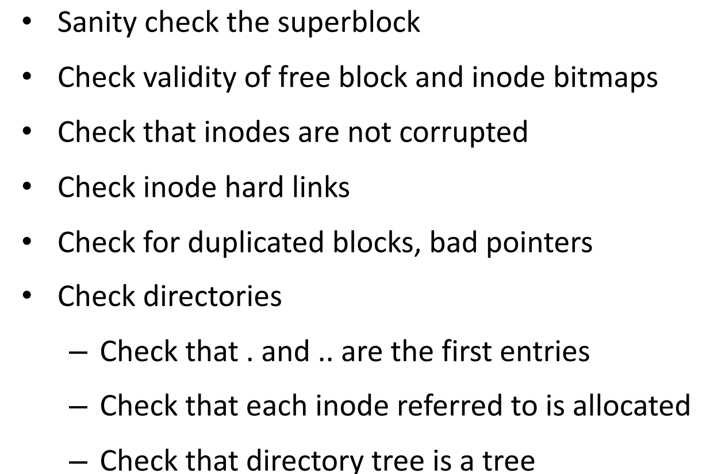

### 磁盘

- 磁道、扇区、柱面

- 文件系统的两种抽象：
  - [文件](5.FileSystem.md#文件)
  - [目录 Directory](5.FileSystem.md#目录%20Directory)
- 

# 两个抽象

## 文件

- 文件系统需要关注的点：命名、文件访问、磁盘管理、保护、可靠性

### 命名

- 对用户屏蔽磁盘系统的细节
- 两段的命名：文件名.扩展名
  - 暗示操作系统应该如何处理这类文件
- 操作系统支持的文件类型：
  - 常规文件：字符文件、二进制文件
  - 目录：用来存目录结构的文件
  - 特殊文件：打印机等（抽象成文件的
  - 操作系统自己就是个可执行文件
- Linux 下会用魔数来表明文件类型（而不是扩展名

### 文件结构

- 看成一个 byte 的数组（no structure
  - 操作系统不关心文件长啥样，不提供帮助也不进行阻碍
  - 非常灵活，UNIX 和 Windows 都用
- 看成一个由固定长度的记录构成的数据结构（例如树

#### Attributes (Metadata)

- 文件类型、地址、大小、时间、保护、？等
- 有个表

### 文件访问 File Access

#### 顺序访问 Sequential Access

- `read_next` / `write_next` / `reset`
- 有 current position 的概念
- 好处是读写可以非常快，达到硬件的峰值

#### 随机访问 Random (Direct) Access

- `read n` / `write n` / `seek n`
- 在哪一个块必须作为一个参数 `n`
- 没那么快

#### 索引访问 Index Access

- index：有指向一块文件的指针
- 先在索引找到对应的表项，再去具体位置读写文件

### 文件操作

- 读写信息的操作：create delete open close read write append seek (get/set)Attributes rename

#### 系统调用

#### Open File

- 将名字当索引太长，因此维护文件描述符
- Per-Process open file table
  - System-wide open file table
  - 
  - 可能有多个 Per-process 的表项指向同一个 system 的表项
  - 为什么要两个
    - 可能不同进程对同一个文件的权限不同
- 要打开一个文件：
  - 先在 system-wide 的 table 里找有没有已经打开了，不然就去目录里找
  - 创建 per-process 的表项，指向 system-wide 的
  - 增加 system-wide 的 open count
  - ？？

#### Index Node

- 存储文件的信息
- offset 放在什么位置：
	- 放在 per-process 的进程表里：不同进程度的速度不一样
	- 放在 system-wide 的进程表里：父子进程，需要读写同一个位置
- Unix 的解决方案：三个进程表
	- 
	- 如果要共享 offset，则指向同一个 open file table entry
		- 如果不要，则指向不同的 open file table entry，但是指向同一个 inode table

#### 文件抽象

- everything is a file
	- 0: stdin, 1: stdout, 2: stderr

### 文件锁

- 两种：共享的锁、独享的锁
- 两种机制：mandatory 强制的、advisory 建议的（？）进程可以看到有锁，但是可以选择忽略

## 目录 Directory

- 目标：命名、效率（快速定位文件）、群组管理

### 单层目录（没啥用

### 层级目录 Hierarchical Directory

- 目录需要保存从文件名到索引号的映射

#### 链接

- 硬链接：alias for inode number，直接指向目标的 inode
  - 不能访问其他文件系统上的文件
  - 带硬链接的目录：删除操作
    - 直接删另一边的目录就会有空指针
    - 用 Reference Counter，记录多少人引用了它
    - 删除一个 link 的时候，Reference Counter - 1，减为 0 的时候就可以释放空间
  - 直接删除目标文件不会受影响（因为 Reference Counter 不是 0，不会实际删除
  - unix 的 .. 目录就是硬链接
- 软（符号）链接：alias for path name
  - 指向另一个特殊文件，特殊文件里存指向连接的绝对路径
  - 可以连接到其它的文件系统，例如网上的文件
  - 解析链接的时候可能会慢一点：
    - 先找到目标文件的文件名，再开始查找
    - 目标文件可能是另一个软链接
  - 删除：直接删除这个特殊文件，目标文件不受影响
  - 直接删除目标文件则软链接会失效
- 硬链接不会改变文件的所有权，原所有用户删除了这个文件后可能导致问题

#### 一般的图目录

- 可能会有环（链接到父目录
- 可以用环检测算法
- 需要垃圾回收机制：孤儿目录得被删掉
  - 因为目录会链接到自己 (.)，Reference Counter 一直不会被清空

### 目录操作

### 挂载

- 挂载点
  - mount 到某个位置后，这个目录里之前的东西就看不到了
  - Windows 只允许 mount 到 root
- 让多个文件系统形成一个逻辑上的层级关系

## 保护

- Authorization、Authentication
- Access Control Matrix
  - 列：Access Control List（ACL
  - 行：Capability List
- Unix
  - 每个用户有 userID 和 groupID
  - 每个文件有三个类别：owner、group（同组的）、other
  - 三个访问模式：Read、Write、eXecute

# 实现

## 文件系统布局

- 是否需要持久化存储
  - 需要持久化的：放在硬盘里 for data storage
  - 不需要持久化的：放在内存里 for data access

### 存在硬盘里的

- 一些成分
  - MBR (Master Boot Record)
  - 分区表，有一个标记为 active，表示 OS 要从它那里 boot
  - Boot Block
  - Partition Control Block：有时也叫 Super Block
  - File Control Block
- 
- 硬盘被分为固定大小的 block，通常 4KB
  - 大部分用来存数据
  - 有一部分用来存储 metadata
    - inode 数组：存储哪些 block 属于这个文件、文件大小、所有者、访问权限
      - 一个 block 可以存储多个 inode
    - Free space tracking
      - 存储每个 block 是否空闲
    - Superblock

### 存在内存里的

- Mount table
- Open-file table (system-wide / per-process)
- Dir structure
- IO buffer

## 分配策略

- 类似于内存的分配

### 连续分配

- 直接丢后面
- 只要存 start 和 length
- sequential access 和 random access 都很快
- 缺点：会有很多碎片、不能更改大小
- 适合用在 CD-ROM 和 DVD
- 扩展：文件变大的时候留个指针扩展到另一个文件

### 链表分配

- 指向下一个 block 的位置
- 坏处：
  - 定位一个随机文件需要大量 IO
  - 指针会浪费空间
  - 指针被污染时会很危险
- 改进：
  - cluster block：一分配就分配 e.g. 4个，但这样也会有 internal 碎片

### 文件分配表 File Allocation Table

- 把所有指针存额外存到一张表里，这样随机访问就不需要遍历链表，直接在表（在内存）里找到相应 block 的 id
- FAT 16：$2^{16}$ entries，最多 4KB 个 block，即 256MB
- 坏处：需要占用较多的额外空间（1TB 磁盘，4KB block，4B per entry，可能要 1GB 的 FAT
- MSDOS 用的，当初是给软盘设计的

### Indexed Allocation

- 每个文件有一个 index block，里面存指针，指向文件的各个普通 block
- 多层 index block：当文件过大时的解决方案（但当文件很小时也浪费？

### Indirect Block

- UNIX-style 的解决方案
- 对于每个 inode，保存一定数量的 block 位置，如果不够，最后一个位置默认指向下一个 inode 的位置
  - 某些 entry 并不直接指向 block 而是指向另一个存了 index 的 block

### 总结：一些考虑因素

- 磁盘比 CPU 慢很多

## 目录的实现

### Entry 怎么设计

- 长文件名：让每个 entry 长度不同，记录 entry length

  - 
  - 但是万一删除文件，就会有一个大小奇怪的空洞

- 或者单独分配一个区域保存文件名，entry 里只要存指针

  - 

- e. g. ext2

  

### 文件查找

- 暴力搜
- hash：实现太复杂
- 用 Btree 存储二元组 \<filename,inode number\>
- 搜索结果可以 cache 起来

# 磁盘空间管理

### block 多大

- date rate：读写速度
  - hard rate：磁盘利用率
  - 有个两者关系图

## 记录 block 是否被分配

### Bitmap

- 一位表示一个 block 是否被分配

### Free List

- 把所有空闲空间看成一个文件，用 linked list 来存储
- 几种改进方式：
  - Counting：同时分配和释放一个 cluster 的 blocks
  - Grouping：链表的一个节点里存好多个空闲 block 的编号

### Disk Quotas 配额

- 配额表
- open file table 里存一个指针 指向配额表
- Hard limit：直接报错
  - Soft limit：允许暂时超过，尤其是登陆进用户的时候

## 操作细节

### 如何读一个文件

- 先打开文件：
  - 从目录树上找，直到找到这个文件的 inode
  - 读取那个 inode，检查权限，返回一个文件描述符
- 再读取文件：
  - 读 inode
  - 读 data block
  - 更新最近访问时间
  - 在 open file table 里更新 offset

### 如何写一个文件

- 先打开文件

### 如何创建一个文件

- 先读目录 inode 和 data
- 读写 free inode 的 bitmap
- 

# 优化

## Cache

- 写策略

### Write back

- 标记为 dirty，以后再一起写
  - 写回时间：手动刷新、buffer 满了、文件关了、定时
- 快，但是有风险，有一致性问题

### Write through

- 慢，但是没有一致性问题

## 预读取

- 当顺序读取的时候很有用（大部分情况
- 随机读写时甚至会降低速度（浪费 IO，还把有用的 cache 替换掉了
- 文件系统分析保存每个文件的访问模式

## 内存映射文件

- 直接将文件映射到内存的某一块
- mmap 系统调用

## 磁盘：减少磁盘读写臂的运动

- 将 inode 放在接近磁盘开始的地方
- FFS: Fast File System
  - 考虑了磁盘的结构
  - 将磁盘分成 block groups
  - 数据局部性：相关的数据放在一起
    - 文件的局部性：放在同一个 group 里
    - 目录的局部性：同一个目录下的 inode 放在一个 group 里
    - 对于很大的目录：将目录扩展到多个 group，或者把大文件单独分配在别的很多个 group 里

## SSD：减少磨损

- 随机读写和顺序读写差不多快

# Consistency

## Crash Consistency

- 主要是 crash 的时候的 consistency
- 给一个文件 append 一个 block
  - 先写 block
  - 更新 inode
  - 更新 bitmap（追踪空闲空间用的

- 这三者只做了一个就 crash 了：只写了 datablock 不会寄，其他两个就有 inode 和 bitmap 不一致的问题
- 解决方案
  - 要是磁盘支持原子性操作就好了
    - 然而磁盘一般不支持（也有人在做
  - 两个可行的：
    - 文件系统一致性检查
    - Jounaling

### 文件系统一致性检查 FSCK (UNIX)

- 不管 consistency，在 reboot 的时候再修复
  - 以 inode 为主，更新 bitmap
  - 四种错误：用了没记录、没用记录了、记录了两次、用了两次（记录指 bitmap 记录它空闲
  - 前三个 trivial，最后一个交给用户处理
  
- 实际上做这些之前还要先检查 superblock 的 sanity

  

- 问题：
	- 需要对文件系统有深入的了解
	- 太慢

### 日志文件系统 Journaling

- 实际写之前，先记录日志
- 一旦操作落盘，就记录下 checkpoing，炸了就从 checkpoint 按照日志重做一边
  - journal write
  - journal commit
  - checkpoint
- NTFS、ext3、ext4 都搞了
- 问题：数据得写了两遍
- Metadata jounaling：只写 metadata 的 jounal，不写 data 的 journal
  - 一致性和性能的平衡
  - 先记录 metadata 的日志再写数据，文件可能有垃圾
    - 因为如果写了 inode，但没写 data，inode 会指向一个垃圾
  - 先写数据再写 metadata 的日志
    - 比较好（没仔细听）
    - UNIX 用的

## 日志结构的文件系统 LFS Log-strctured FS

- log 和 jounal 不太一样（？
- 对小文件性能更好的方法
- 直接顺序地写 data 和 inode
- 然后维护一个 map，指向所有的 inode
- （有点没听）
- Gatbage collection
  - （没听）
- 缺点
  - 得定时 garbage collection
  - 和现有的文件系统不兼容，导致 good idea but 没人这么用

## 文件系统备份

- 一直备份没访问过的的数据是愚蠢的行为（增量备份
- 数据压缩
- 在活跃的文件系统上做备份实际上很困难

## 虚拟文件系统 Virtual FS

- object oriented，调用通用的接口，不用管底层的实现
  - 例如 POSIX
- 挂载了之后要在 VFS 中注册

## 关系数据库 Structured Query Lang

- 文件系统提供了较为简陋的文件索引机制
  - 无法保证多操作之间的原子性
- 直接使用文件系统面临一致性和性能问题
  - 关系数据库
  - Key-Value Store (NoSQL DB)

- ACID
  - Atomicity
  - Consistency
  - Isolation
  - Durability
- 2010s 将没有关系数据库可以在支撑社交网络，只能用 key-value
- CAP Theorem
  - Consistency 
  - Availability
  - Partition Tolerance
    - 能分隔在多地，有延迟啥的，节点可能随时消失
- 分布式系统的基础
- 更好的分布式友好数据模型：
  - LSM Tree
    - 模拟 Memory Hierachy，上面小下面大
    - 满了的话就把两个合并成一个大的丢到下一层
- Takeaway message
  - 文件系统提供了较为简陋的文件索引机制
    - 无法保证多操作之间的原子性
  - 直接使用文件系统面临一致性和性能问题
    - 关系数据库
    - Key-Value Store (NoSQL DB)
