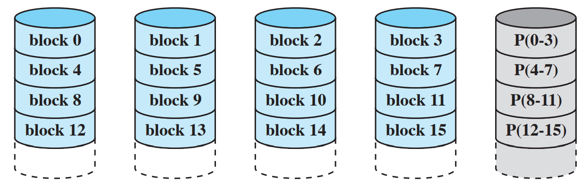
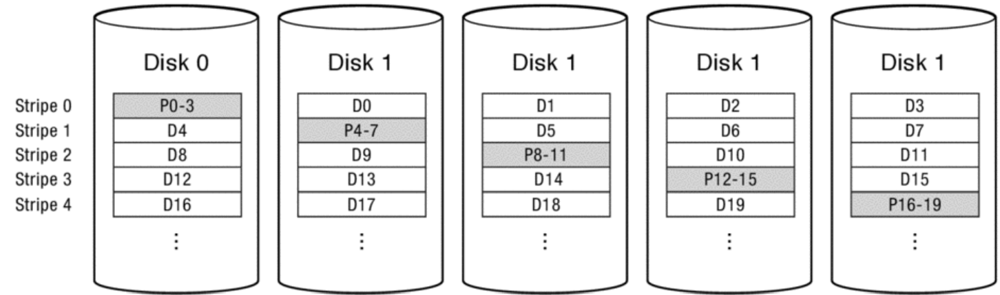

- 设备分类
  - block
  - character
  - net
  - clock & timer

- 总线 bus
  - 协议 Protocol
  - 让 $n$ 各设备通过同一条线连接
  - 一次只能两个通信

- 控制器
  - 四个寄存器：data-in data-out status command

### CPU 和设备通信

#### 端口映射（in/out 指令）

- 每个寄存器被分配了一个独有的 IO 端口号
- 好处是汇编代码好康（一眼就是 port
- 坏处是程序得夹杂汇编，还不能用内存的保护机制，得搞另外的保护机制
- （并不需要背，考试应该会提供）

#### 内存映射（load/store 指令）

- 将寄存器映射到主存的地址空间
- 编程时方便
- 但是可能会触发 cache 机制，cache 寄存器就寄了
- 内存映射更主流，但 port 有时候也会用

#### Direct Memory Access

- DMA 控制器可以直接将 IO 读到内存，完成时给 CPU 发终断（相当于替 CPU 完成了读写
- 可能会长时间占用 bus
- CPU 得预先告诉 DMA 要搞什么事情（比如读 100 个字节，至于具体的循环就在 DMA 里跑
- 

### IO 通知 OS

- IO 完成操作或者碰到问题 就需要 OS 介入
- 轮询 / IO中断

## Part 2

### Programmed IO

- 就是轮询
- 

### Interrupt Driven IO

- 

### 用 DMA

- 

## IO 软件

- 层级抽象
- device driver
  - 字符设备：read write
  - 块设备：read write seek
  - 网络设备：套接字
  - 时钟设备：ioctl (UNIX)

## Buffering

### 双缓冲

### 循环缓冲

## 错误处理

- retry
- 或者直接给用户返回一个错误
- （？

## 同步和异步 IO

# 磁盘

- 

## 格式化

- 低级格式化
  - 前导码 preamle：标记一个 sector 的开始
  - Data（~512 字节）
  - 纠错码 ECC（~114 bits？）：冗余的信息，用来恢复读错误
- 为什么每个磁道上的 0 号扇区不对齐？
  - 旋转的时候读到下一个磁道时，可能会有惯性啥的，还会转一点
- 交织 interleaving：0，4，1，5，2，6……中间隔一个扇区
  - 为了让数据有时间能够被传回到主存 CPU 啥的，保证缓冲区不会爆掉
  - 如果转的更快，可以隔两个扇区 double interleaving（双交织
  - 实机上把缓冲区搞大一点可以不需要这样的操作

## 磁盘臂的调度算法

- 磁盘延迟=寻道时间+旋转时间+传输时间
  - 寻道时间：1-20 ms
  - 旋转时间：4-15 ms
  - 传输时间：100-1250 MB/s（什么垃圾硬盘
  - 所以瓶颈一般在前两步（对于小数据的读写
- 磁盘调度本质上是一个寻找最短路径的问题（？

### FIFO（FCFS

- 好处：公平，和用户程序预期的表现相同
- 坏处：不好找，慢

### 最短寻道时间 SSF/SSTF

- Shortest Seek (Time) First 
- 直接读写请求队列里离目前为止最近的地方
- 好多人在用，坏处：Starvation，远的可能一直读不到
- 这玩意是贪心，而在最短路上贪心不是最优解

### 电梯算法 SCAN/LOOK

- 往一个方向走一直到最顶端（实机上并不要到顶端，到最后一个请求就行了，严格来讲 SCAN 算法要求读到最顶端，而 LOOK 不用），满足这一趟上的所有请求；再反过来跑
- 没有 starvation
- 极端情况可能会略慢一点
- LOOP SCAN：只从左向右扫，扫完复位，重新从左向右扫

## 错误处理

- 磁盘出厂时应该有冗余扇区，有扇区坏了就用备用的
  - 直接重映射？还是整个往后移？一般倾向于用重映射（？）因为不用重格式化分区信息啥的

## 廉价冗余阵列 RAID

- Redundant Array of Inexpensive/Independent Disks
- RAID 0
  - 两个盘交替存信息：0在A，1在B，2在A，3在B，……：读速×2，容量×2，冗余0
- RAID 1
  - 就是两个盘存一样的信息：读速×2，容量×1，冗余1
  - RAID 10
- 校验位 Parity
  - 前面的全部异或起来，可以检错也可以恢复
  - 有个假设：我们知道是哪个磁盘错了（一般磁盘控制器确实知道）；要是不知道就不好说了（RAID 2）
- RAID 4
  - P 表示 Parity
  - 最后一个磁盘读写频率很高
  - 其它磁盘读频率不高吗？确实不高，因为并不要读，直接拿校验位异或改之前的位就得到其它所有的异或和了
- RAID 5
  - 旋转校验
  - 
- RAID 6
  - 两个 parity 位
  - 

- 8简答40% 8应用60%
  - 应用会考银行家算法
    - 判断安全状态、死锁状态
  - 同步原语、条件变量、信号量（~一道大题
  - 集中在同步并发、文件系统、内存管理、调度（~一题）
  - 进程线程、设备考的少，都会考个一两题

