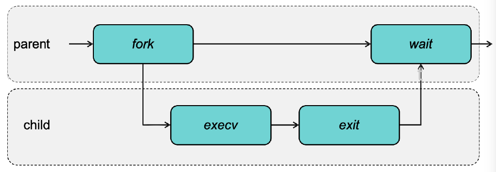

## 进程和线程

### 进程和线程的状态转换

#### 进程

- 
- 
	- Orphan 孤儿态：父进程在子进程之前结束，此时 init 进程成为它的父进程，它会周期性地清理孤儿进程
	- Zombie 僵尸态：父进程没有调用 wait，子进程就结束了，内核将其转为僵尸态，释放大部分资源

#### 线程

- 

### 系统调用

- 用于进程管理的系统调用
	- fork
	- exec
	- waitpid
	- exit
- 用于文件管理的系统调用
	- open
	- read
	- write
	- lseek
	- stat、fstat：查看文件信息，fstat 只能用于已经被打开的文件
- 用于目录管理的系统调用
	- mkdir、rmdir、link、mount
- 

### 进程控制块

- 
- 包括
	- 进程状态
	- PC（程序计数器）
	- CPU 寄存器
	- CPU 调度信息
	- 内存管理信息
	- 计数信息：已经用的 CPU 时间啥的
	- I/O 状态信息：设备、打开文件的表
- [2.Process&Thread](2.Process&Thread.md#Definition)似乎还有一些

### 多道程序设计

#### 上下文切换

- 什么会引发上下文切换

- 进程的 Context Switch
	- 流程：
		- 进程在运行
		- 切换到内核
		- 保存进程状态
		- 选择新的进程
		- 加载新进程状态
		- 新进程正在运行
- 用户级线程的 Context Switch
	- [用户线程的 Context Switch](2.Process&Thread.md#用户线程的%20Context%20Switch)
- 内核级线程的 Context Switch
	- 类似于进程，replace 进程 with 内核级线程

#### CPU 利用率

- 进程等待 IO 的概率为 p，n 个进程，则 CPU 利用率 $1-p^n$

### 线程控制块

- 
- 

## 调度

### 调度的指标

- 
	- 吞吐量：只看任务数，不看时间
	- 周转时间：从一个批处理作业提交时刻开始直到该作业完成时刻为止的统计平均时间（看看期中作业？
	- CPU利用率：不是一个好的指标
	- 响应时间：发出命令到得到响应之间的时间
	- [Basics](2.Process&Thread.md#Basics)

### 批处理系统的调度

- [Batch 系统调度算法](2.Process&Thread.md#Batch%20系统调度算法)
- 先来先服务 FCFS
- 最短作业优先 SJF
	- 所有作业必须同时到达
	- 理论上的 turnaround time 最优解
- 最短剩余时间优先 SRTF
	- 可以不同时到达
	- 如何估计剩余时间？[估计运行时间](2.Process&Thread.md#估计运行时间)

### 交互式系统中的调度

- [交互式系统调度算法](2.Process&Thread.md#交互式系统调度算法)
- 轮转调度 RR
- 优先级调度
	- 饿死，有高优先级的就不运行低优先级的
	- 解决方法：老化（周期性提升优先级
- 多级反馈队列 MFQ
	- 高优先级的队列 RR 的时间片短，用完时间片就去下一优先级
	- 也会饿死，也要老化
	- Game the system：
		- 在时间片用完之前请求 I/O
		- 解决方案：记录一段时间内进程使用的总时间，而不是只看是否用完时间片

### 实时系统调度

- [实时系统调度算法](2.Process&Thread.md#实时系统调度算法)
- 准入控制
	- $m$ 个周期性进程，每个周期 $p_i$，处理时间 $c_i$，需要满足$\sum_{i=1}^m\frac{c_i}{p_{i}}\le 1$。
- 单调速率调度
	- 优先级是周期的倒数
	- 最优性[单调速率 Rate Monotonic Scheduling](2.Process&Thread.md#单调速率%20Rate%20Monotonic%20Scheduling)
	- 实际上最高 CPU 利用率是 $\sum\limits_{i=1}^{m} \frac{c_i}{p_{i}} \le N(2^\frac{1}{N}-1)$（充分不必要条件，满足一定行，不满足不一定不行）
- 最早截止期限优先

## 内存管理

### 内存管理需要实现的功能

- 记录哪些内存正在使用
- 当进程需要时为其分配内存
- 保护内存，保证操作合法
- 使用完毕后释放内存
- 同时还要最大化物理内存的使用率和系统的吞吐量

### 地址空间

- [地址空间](3.MemoryManage.md#地址空间)
- 虚拟地址（逻辑地址）：由 CPU 生成的地址
- 物理地址：内存单元接收到的地址
- 地址绑定（将可重定位的地址转换成绝对地址）：编译时/加载时/运行时（需要硬件支持，下文就是：
- 基址(base)寄存器与界限(limit)寄存器 & 动态重定位：运行的时候基址寄存器载入该程序在物理内存中的实际地址，界限寄存器载入程序的长度。
	- 由 MMU 管理，MMU 是硬件
	- 地址转换[页表和地址转换✔](3.MemoryManage.md#页表和地址转换✔)

### 连续内存分配

- [Process level](3.MemoryManage.md#Process%20level)
- 多分区分配 ：给每个进程连续地单独分配一块空间，不好❌
- 固定分区：先划分成固定大小的区域，每个进程拿一块，不好❌
- 可变分区：动态分配✔（可能会有空洞
	- 管理空闲空间
		- Bitmap，一位代表一个小单元
		- 链表，每一个节点存一个分区（可能是空的也可能属于某一个进程），相邻的空分区会合并（所以最好做双向链表

#### 动态空间分配算法

- First-fit：分配第一个足够大的空洞（搜索的少
- Next-fit：记录上一次分配的空洞，从它开始找下一个足够大的空洞
- Best-fit：分配能容纳的最小空洞（会有小碎片
- Worst-fit：分配最大的空洞
- Quick-fit：分别维护不同常见大小的链表（但是当进程退出时，检查是否能合并空洞代价很大（因为相邻空洞不是连续存的，找它要遍历

### 碎片

- 外部碎片：有足够的空间，但是被占用的部分分割成不连续的小洞而不能使用；占用的部分就是外部碎片
	- 50% 定律：如果有 N 个块，用 best-fit 分配会导致 0.5N 个由于外部碎片而被浪费 
	- 解决方案：压缩（必须支持动态重定位
- 内部碎片：分配的内存比实际需要的大，浪费的部分就是内部碎片

### 转换检测缓冲区 TLB

- [加速 Caches](3.MemoryManage.md#加速%20Caches)
- 
> 本质上虚拟页号到物理页号是一个映射函数，TLB 里只保存了这个映射关系的一部分元素

- TLB miss：
	- soft miss：页表项不在 TLB，但页在主存
		- 更新 TLB，不需要磁盘 IO
	- hard miss：页不在主存（页表项当然也不在 TLB
		- 需要访问磁盘调页
	- 硬件管理（x86
		- TLB miss 不会报异常，只是指令执行会被暂停
	- 软件管理（MIPS
		- 硬件提异常，叫 OS 来处理
		- 更灵活，但是效率较低

> - 异常 Exception
> 	- 中断 Interrupt
> 	- 陷阱 Trap
> 	- 故障 Fault
> 	- 中止 Abort

- 一致性
	- 上下文切换后，旧的 TLB 表项就无效了
		- 需要冲刷 TLB
		- 给表项增加 ASIDs(Address-Space Identifiers) 标签，指明是在哪个地址空间的表项

### 有效访问时间 EAT

- [EAT](3.MemoryManage.md#^d31636)
- EAT = $(\epsilon+t)\alpha+(\epsilon+2t)(1-\alpha)$
	- 第一项是 hit，第二项是不 hit，不 hit 要访问两次内存，一次找页表，一次找页
	- $\alpha$: TLB 命中比率, $\epsilon$: 访问 TLB 用时, $t$: 访问主存用时

### 分段

- [Segmentation](3.MemoryManage.md#Segmentation)

#### 段表的结构 & 地址转换

- 每个进程都有一个段表（实际上 Linux 只有一个全局的段表
- 每个进程有个段表，每个 entry 包括段基址 base 和段界限 limit
- STBR 寄存器保存段表位置，STLR 寄存器保存一共有几个段（段号超过 STLR 就是非法的

#### 分段中的地址转换

- 逻辑地址被分为 <段号，offset>
- 按照段号去找段基址

### 分页

- [Paging](3.MemoryManage.md#Paging)
- 通常页框号指的是物理页号

#### 页表的结构 & 地址转换

- 结构（虚拟页号是索引，不包括在页表项里 
- [地址转换](3.MemoryManage.md#^5f2b76)
- 页面共享
	- 不同的页表项指向同一个页框号
	- 能用来共享：系统库、fork 的两个子进程、跨进程通信

#### 页表的实现方式

- PTBR 寄存器保存页表位置，PTLR 寄存器保存页表一共有多少项（类似于段表[段表的结构 & 地址转换](复习提纲.md#段表的结构%20&%20地址转换)
- 多级页表
	- 对页表再进行分页，存上层页表
	- （类似于递归的过程
	- 不用将整个页表保存在主存里（能节省多少空间？期中考试题
- 倒排页表
	- 页表索引是页框号（相当于反函数
	- 表项结构 <进程号，虚拟页号，offset>
		- 多了一个进程号，剩余部分就是反了一下
	- 把索引号填在原来虚拟页号的位置

#### 页面大小

- [页面大小的选择 Page Size](3.MemoryManage.md#页面大小的选择%20Page%20Size)
- 进程平均占用内存 $s$ 字节，页面大小 $p$ 字节，每个页表项 $e$ 字节
	- 需要 $\frac{s}{p}$ 页，页表占用 $\frac{se}{p}$ 字节
	- 内部碎片占用 $\frac{p}{2}$ 字节
	- overhead$=\frac{se}{p} + \frac{p}{2}$，$\arg\min\limits_{p}=\sqrt{2se}$

### 虚拟内存

#### 请求调页

- 页表项加个有效位，不有效就 Page Fault
	- Lazy Pager：直到被用到才调页
	- Pure Demand Paging：开机内存全空，OS 第一条指令就 Page Fault

#### 缺页错误处理

- 错误类型[Page Fault](3.MemoryManage.md#Page%20Fault)
- 处理流程

### 页面置换算法

#### FIFO, Optimal, LRU, NRU, NFU

- [调页算法](3.MemoryManage.md#调页算法)（里面有些不在考点里
- 
- Optimal：理想状况，调出未来最长时间不用的页
- LRU：好但代价高，其他方法都是在近似 LRU（介于 Optimal 和其余之间？
	- 计数器实现 ：计数器保存被引用时的时钟（最小的是 LRU
	- 栈实现：用双向链表实现，被引用了就移到栈顶（栈底的就是 LRU
- NRU：(Reference bit, Modify bit)
	- 依次替换 (0, 0), (0, 1), (1, 0), (1, 1)
	- 类内随机
- NFU：存个计数器，每次时钟中断时检查，用了就 +1

#### 缺页中断率 & 页框分配

- 缺页中断率：进程提 page fault 的概率 $\in[0,1]$
- TODO：页框分配是啥？

### 工作集

#### 抖动 & 访问局部性

- 抖动（[Thrashing](3.MemoryManage.md#Thrashing)）：一个进程拥有的物理内存太少，一个进程花费几乎所有的时间置换页面（需要减少多道程序数
- 访问局部性
	- 时间局部性：**同一个地址**，访问过后近期可能再访问
	- 空间局部性：附近地址未来可能会再被访问

#### 工作集页面置换算法

- 工作集 [Working Set](3.MemoryManage.md#Working%20Set)：一个进程在最近 k 次访问中访问最频繁的页，最好别换
	- 近似：在 $\tau$ 时间内……
- WSClock [WSClock](3.MemoryManage.md#WSClock)
	- reference bit R，modify bit M，距离上次使用时间 age
	- 保存一个页框的循环列表
	- 如果 R = 1：R = 0，age = 当前时间，指针前进一格
	- 如果 R = 0：检查上次访问时间
		- 如果在 $\tau$ 时间内用过：age = 当前时间，指针前进一格（即保留这个页
		- 如果在 $\tau$ 时间内没用过：置换这个页。如果 M = 1，先写回，不然就直接置换

## 同步

- [4.Sync&Deadlock](4.Sync&Deadlock.md)

### 条件竞争

- 见下文

### 临界区

- 一段访问共享的资源的代码
- 四个性质：
	- **安全性**：两个进程不能同时进临界区
	- 对运行速度和 CPU 数量不能作任何假设
	- 临界区外的进程不能阻塞任何其它进程
	- **活性**：进程不能一直等着进不了临界区域

### 互斥

#### 忙等待

- [Implementation - busy waiting](4.Sync&Deadlock.md#Implementation%20-%20busy%20waiting)
- 关中断 ❌
- 锁变量 ❌：搞个变量，1 代表进临界区，0 代表不在临界区
- 严格轮转 
	- 多个进程？（turn = i + 1？
	- 问题：如果 p0 的非临界区代码跑得太慢，会阻塞 p1，违背了临界区第三个准则
- TSL 指令
	- **原子性地**读一个地址，保存在一个寄存器里，并朝那个地址写一个值
	- 这样就可以实现锁变量了
	- 互斥锁
	- XCHG 指令有类似功能：原子性地交换两个地址的值
- 忙等待缺点：
	- 占用 CPU 时间
	- 优先级反转
		- [问题：Priority Inversion](4.Sync&Deadlock.md#问题：Priority%20Inversion)
		- 解决方法：优先级继承协议，继承被它阻塞进程的最高优先级

#### 皮特森算法

- 
- [jyy 如是说](4.Sync&Deadlock.md#Peterson's%20solution)

- sleep & wakeup 不考？

### 条件变量

- 升级版的互斥锁
- 有三个成员函数：
	- `Wait(ConditionVariable *cv, Lock *lock)`：原子操作，让调用它的进程 sleep 并且释放锁
	- `Signal(ConditionVariable *cv)`：（随机）唤醒一个正在等待此条件变量的进程
	- `Broadcast(ConditionVariable *cv)`：唤醒所有在等待这个条件变量的进程
- 本质上就是原子化了 unlock sleep lock 这三个操作
- **用条件变量的时候一定要上互斥锁！**
- 用条件变量实现生产者 - 消费者问题
- 拓展到多个生产者 / 消费者？（期中考试

### 信号量

- [信号量 Semaphores](4.Sync&Deadlock.md#信号量%20Semaphores)

#### P

`P()`：down / wait
	- 实现（只是理想化的描述）：

#### V

- `V()`：up / signal
	- 实现（只是理想化的描述）：
- 随机选取一个进程唤醒

#### 例子

- 实现生产者消费者问题
	- 能不能调换位置？
	- 不能。P 操作可不会释放锁，因此得放在 mutex 外面
	- 这个 mutex 是为了锁读写 item 的操作，而不是为了锁信号量
- 信号量是更高层的抽象，可以用条件变量和互斥锁实现
	- 

### 管程

- [Monitor 管程](4.Sync&Deadlock.md#Monitor%20管程)
- 管理申请访问共享数据的程序（锁或者条件变量
- 两个队列
	- 管程入口处的等待队列
	- 管程内条件变量的等待队列
- 最后一个绿的上面应该是 not full 

#### Hoare

- 调用 signal 的进程立刻被暂停，释放锁
- 某一个 wait 的进程立刻获得锁，开始运行
- 调用者直到收到 signal 的进程退出或者再次 wait
- 收到 signal 的进程可以假设运行前后状态没变

#### Brinch Hansen

- 调用 signal 的进程立刻退出管程（因此 signal 必须是最后一步操作
- 某一个 wait 的进程被放在 ready list 上等待调度

#### Mesa

- 某一个 wait 的进程被放在 ready list 上等待调度
- signal 者可以执行完再退出，收到信号的进程会等它退出了再进来
- 容易实现，用的多✔

### 生产者-消费者问题

### 读者-写者问题

- [读者写者问题](4.Sync&Deadlock.md#读者写者问题) [如何实现 ShouldWait](4.Sync&Deadlock.md#如何实现%20ShouldWait)
- 问题描述：
	- 同时可以有任意数量读者
	- 同时只能有一个写者
	- 如果有写者则不能有读者
- 算法框架（上两张图是读者，最后一张是写者，mesa

#### 读者偏向

- 
- 如果一直有读者，写者会饿死

#### 写者偏向

- 
- 如果一直有写者，读者会饿死

#### 相对公平

- 使用信号量，V 的时候按照 FIFO 顺序 signal
- 
- 此时 shouldwait 函数用哪个都一样

### Read-Copy-Update

- TODO？?
- [Read-Copy-Update RCU](4.Sync&Deadlock.md#Read-Copy-Update%20RCU)
- 基本机制
	- 发布 - 订阅制度
	- 等待前面的读者完成
	- 维护多个版本

#### 宽限期

- 从更新发布到最后一个读旧数据的读者走的时候
- 出了宽限期才能删除旧数据
- RCU 读者侧临界区
	- rcu_read_lock() 开始读
	- rcu_read_unlock() 读完了
	- 只是表示在不在读，并不是真的锁

### 哲学家就餐问题

- [哲学家吃饭问题](4.Sync&Deadlock.md#哲学家吃饭问题)

#### 死锁解法❌

- 一起等右边的

#### 饿死解法❌

- 如果所有人同时开始调度就会饿死
- 改成 randomTime 是一个不可靠的改进方法

#### 一把大锁

- 只能一个人吃

#### 表示状态

- [表示状态](4.Sync&Deadlock.md#表示状态)
- test 意思是检查能不能释放，如果左右都不在吃，那可以给自己的信号量 V 一下，就能释放了，能直接吃了

#### 单数拿左边，双数拿右边

## 死锁

### 四个必要条件

- 互斥（或者同时访问资源的进程数量有上限
- 持有并等待
- 不可抢占
- 环路等待（循环的等待条件

### 资源分配图

- [资源分配图](4.Sync&Deadlock.md#资源分配图)
- 用有向图来表示死锁
	- ⚪ 表示进程
	- ⬜ 表示一种资源
		- 框里的点⚫表示好多个同种资源
		- 每种类型一个资源、每种类型多个资源
	- ⚪$\rightarrow$⬜ 表示进程等待资源
	- ⚫$\rightarrow$⚪ 表示资源被进程持有
- 如果没有环：必没有死锁
	- 有环，环里只有一个资源：一定有死锁
	- 有环，环里有多个资源：可能有死锁

### 死锁检测

- 不管（鸵鸟算法

#### 每种类型一个资源

- 环路检测算法（DFS

#### 每种类型多个资源

- 一些表示
	- 存在资源向量 E：总资源数，m×1
	- 可用资源向量 A：资源剩余量，m×1
	- 当前分配矩阵 C：每个进程所持有的资源数量，n×m
		- 矩阵第一维表示进程，第二维表示资源
	- 最大持有矩阵 M：n×m
		- 最多拿多少个
	- 需求矩阵 R：每个进程请求的资源数量 n×m
- 算法
	- 寻找一个没有标记的进程 Pi，它所请求的资源小于等于 A。
	- 如果找到了这样一个进程，那么将 C 矩阵的第 i 行向量加到 A 中，标记该进程，并转回 1。（因为满足了这样的条件就可以释放 C_i 里面的资源了
	- 如果没有这样的进程，那么算法终止
	- 所有没被标记的进程全部是死锁进程

### 死锁避免

- 和死锁检测的区别是这里资源请求是一个个来的

#### 安全状态 & 不安全状态

- 资源轨迹
	- 横轴：进程 A 的指令条数
	- 纵轴：进程 B 的指令条数
	- 某些指令可能会需要资源
- 安全状态：存在某种调度方法，使即使所有进程同时突然请求最大资源（即 M 矩阵）也会死锁
- 反之不安全

### 银行家算法

- 检查一个需求是否会导致非安全状态
	- 如果是，就拒绝这个请求（之后再考虑
	- 否则实施这个请求
- 多出一个矩阵：需要剩余矩阵 N：n×m，是最大持有矩阵 - 当前分配矩阵
- 算法（一般是来一个 R 矩阵，把它应用了之后（A 减，N 减，C 加）再跑算法检查是否能满足这个吊要求
	- 寻找一行（一个进程），它未满足的资源需求全部小于等于 A
		- 如果没有这样的行，系统最终必然会死锁
	- 假设这个进程的要求被满足了，将这个进程标记为已完成，将其持有的资源加到 A 上
	- 重复以上两个步骤，直到所有进程都被标记，那就是安全状态。如果还剩，那么就会死锁

### 死锁预防

#### 破坏互斥条件

- 把数据改成只读
- Read Copy Update
- 代理进程：所有读写都要通过代理进程来读写
- Spooling technique：将资源对进程进行抽象，实际上只有一个 守护进程去真正操作资源

#### 破坏占有并等待

- 让进程一下子拿所有的资源
- 让进程在拿资源前先释放所有资源，然后再一起拿

#### 破坏不可抢占

- 如果一个线程拿着资源还要别的不能立即给他的资源，那么就抢占它拿着的资源（偷偷释放掉
- 抢占的资源放回到这个线程等待的资源的列表中（就是再假装它再申请这么多资源
- 只有当新旧资源都能给的时候再让他跑

#### 破坏环路等待

- 让进程遵守这样一个规则：每次只能拿一个资源。如果要拿，先放掉之前的
- 给资源排序，要求所有进程按照某种顺序申请资源
	- eg. 哲学家问题中申请叉子的编号只能降序排列

## 文件系统

### 文件系统的功能

- 命名：将名字翻译成磁盘上的块
- 访问文件：读、写等
- 磁盘管理
- 保护：不同用户……
- 可靠性：不能丢失数据

### 文件

#### 文件的命名和属性

- [命名](5.FileSystem.md#命名)
- 命名
	- 文件名.扩展名
	- 扩展名暗示操作系统如何处理
- 类型
	- 常规文件
		- ASCII 文件
		- 二进制文件
	- 目录
	- 特殊文件
- 每个操作系统必须要能识别它自己的可执行文件
	- 扩展名和魔数都能用来标记文件类型

- [文件结构](5.FileSystem.md#文件结构)

#### 文件访问

- [文件访问 File Access](5.FileSystem.md#文件访问%20File%20Access)
- 顺序访问：read next，write next，reset
- 随机访问：read n，write n，seek n
- 索引访问

#### 与文件相关的操作

#### inode

- 存储文件的信息

#### 打开文件表

- 打开文件表可以是进程级的也可以是系统级的（？
- 如果是系统级的，例如 UNIX 层级关系可以是：
	- per-process 的文件描述表
	- system-wide 的打开文件表
	- system-wide 的 inode 表
	- 
- 要打开一个文件，先在系统打开文件表中搜索
	- 如果有，在进程的打开文件表中创建一个条目指向它；并将打开文件数 + 1
	- 否则在目录里查找这个文件名

### 目录

#### 目录的层级结构

- 绝对路径、相对路径、./..
- 目录保存了从文件名到文件索引的映射
- root 的 inode 编号为 2

#### 链接

- [链接](5.FileSystem.md#链接)
- 硬链接
	- 通过 inode 编号指向文件，引用同一个物理地址
	- 每一个 inode 带有链接计数器，只有当没人硬连接到它才会物理删除
	- 不能链接到其它文件系统、不能链接到目录（不然 .. 就不是良定义的了
	- 不改变文件所有权
- 软链接
	- 通过文件名（路径名）指向文件
	- 搜索的时候先找到文件名再去找文件，可能比较慢
- 删除链接：
	- 硬链接：可能删文件；软链接：不动
- 删目标文件：
	- 硬链接：还有效；软链接：寄了
- 文件和目录都是两种抽象

- [挂载](5.FileSystem.md#挂载) [保护](5.FileSystem.md#保护)

### 文件系统布局

- 文件系统需要维护：
	- 在磁盘上的数据结构：需要持久化，for data storage
	- 在内存中的数据结构：不需要持久化，for data access
- 磁盘上的数据结构
	- MBR 主引导记录
	- 分区表，有一个 active，从那里 boot
	- 文件控制块：关于文件的信息
	- 每个分区有的
		- Boot Block：引导分区，每个分区都有
		- 分区控制块（Super Block）：关于分区的信息，块数量、大小、空闲的块列表；关于文件系统的信息（第一个分区，挂载的时候会读）
		- 一个 inode 数组
		- 闲置空间管理信息：bitmap 或者链表
- 内存中的数据结构
	- 挂载表
	- 系统级的打开文件表
	- 进程级的打开文件表
	- 目录结构
	- IO 缓冲

### 文件存储的实现

#### 连续分配

- 只需要存开始的 block 号和 block 数
- 顺序访问很快，随机访问计算地址也很快
- 缺点：不能改变大小，产生外部碎片；CD-ROM 和 DVD 用的多

#### 链表分配

- 每个块存储一个指向下一个块的指针
- 坏处：
  - 定位一个随机文件需要大量 IO
  - 指针会浪费空间
  - 指针被污染时会很危险
- 改进：
  - cluster block：一分配就分配 e.g. 4个，但这样也会有 internal 碎片

#### 文件分配表

- 把所有指针存**额外**存到一张表里，这样随机访问就不需要遍历链表，直接在表（在内存）里找到相应 block 的 id
- FAT 16：$2^{16}$ entries，最多 4KB 个 block，即 256MB
- 坏处：需要占用较多的额外空间（1TB 磁盘，4KB block，4B per entry，可能要 1GB 的 FAT

#### 索引分配

- 每个文件有一个 index block，里面存指针，指向文件的各个普通 block
	- 当文件被打开时把 index block 调进内存
- 如何确定 index block 的大小？
	- 多层 index block：当文件过大时的解决方案（但当文件很小时浪费
- inode
	- 
	- 除了文件属性还存例如 7 个 block 的地址
	- 最后一个地址指向下一个 inode，如果一个 inode 不够存的话
	- 

### 目录的实现

#### 目录项中包含的信息

- 目录项包含的信息
	- 文件名、扩展名
	- 整个文件在磁盘上的地址
	- 第一个块的编号
	- inode 的编号
	- 文件属性
- 可以直接存在 entry 里（MSDOS）也可以是一个指针指向一个 inode（Unix V7）

#### 不同长度文件名

- 方法 1：约定文件名以一个特殊字符结束
	- 但是万一删除了就会有大小奇怪的洞
- 方法 2：将所有文件名保存在一个堆中，然后存一个指针指向它

### 在目录中查找文件

- 线性遍历：太慢
- hash+拉链：实现太复杂
- 用 Btree 存储二元组 \<filename,inode number\>
- 搜索结果可以 cache 起来

### 磁盘空闲空间管理

#### block 大小

- date rate：读写速度
  - hard rate：磁盘利用率
  - 有个两者关系图
- 之前大部分是 1～4KB
	- 现在可以增加到 64 KB

#### 空闲空间管理

- bitmap
	- 一个 block 一个 bit，也可以几个 block 一个 bit
	- 需要额外空间
- freelist
	- 就是链表，指向下一个空闲的 block
	- 只需要保存链表头，省空间

### 文件系统性能

#### 缓存 Cache

- block 置换策略（FIFO，second chance，LRU
- 写回策略
	- write back：标记为 dirty，等到必要的时候再写回
		- 手动冲刷、block 被弹出、文件被关闭、固定时间
		- 可能会有一致性问题，系统故障会丢失所有修改
	- write through
		- 没有一致性问题，但是慢
- 预读取
	- 顺序读取的时候有用（大部分情况
	- 随机读写反而会降低性能（浪费 IO，还把有用的 cache 替换掉了

#### 快速文件系统

  - 考虑了磁盘的结构
  - 将磁盘分成 block groups
  - 数据局部性：相关的数据放在一起
    - 文件的局部性：放在同一个 group 里
    - 目录的局部性：同一个目录下的 inode 放在一个 group 里
    - 对于很大的目录：将目录扩展到多个 group，或者把大文件单独分配在别的很多个 group 里

### 文件系统一致性

- 从错误中恢复
- 给一个文件 append 一个 block
  - 先写 block
  - 更新 inode
  - 更新 bitmap（追踪空闲空间用的

- 这三者只做了一个就 crash 了：只写了 datablock 不会寄，其他两个就有 inode 和 bitmap 不一致的问题
- 解决方案
  - 要是磁盘支持原子性操作就好了
    - 然而磁盘一般不支持（也有人在做
  - 两个可行的：
    - 文件系统一致性检查 FSCK
    - Jounaling

#### 文件系统一致性检查

- 重启的时候再检查，下面是检查步骤：
- 检查 Superblock 完整性
- 检查空闲空间和 inode 的 bitmap，和实际情况核对
	-  以 inode 为主，更新 bitmap
	- 四种错误：
		- 用了没记录：问题不大，向系统报告出错
		- 没用记录了：问题不大，记录一下
		- 记录了两次：问题不大，删掉一个
		- 用了两次：严重错误，通常交由用户处理
		- （记录指记录他不空闲
- 检查 inode 完整性
- 检查硬链接
- 检查有没有重复的 block 和错误的指针
- 检查目录
- 问题：
	- 需要对文件系统有深入的了解
	- 太慢

#### 日志文件系统

- journal write
	- 
- checkpoint
	- 一整套流程走完就存一个 checkpoint
- 为了加速，先写 TxB 和三个 journal write，然后写数据 journal commit，写完再写 TxE checkpoint
- 恢复：
	- 如果在 commit 前：忽略
	- 如果在 commit 和 checkpoint 之间：重做
	- 如果在写 checkpoint 时：重写一边
- Metadata jounaling：只写 metadata 的 jounal，不写 data 的 journal
  - 一致性和性能的平衡
  - 先记录 metadata 的日志再写数据，文件可能有垃圾
    - 因为如果写了 inode，但没写 data，inode 会指向一个垃圾
  - 先写数据再写 metadata 的日志
    - 比较好
    - UNIX 用的

### 虚拟文件系统

- 面向对象，统一接口（例如 POSIX
- 挂载了之后在 VFS 中注册，提供函数地址
- 使用的时候创建一个 v-node，然后让实际的文件系统把 inode 信息装进 v-node，然后返回 v-node 地址

## 设备管理

### 设备控制器

- IO 控制器是可以操作端口、总线、设备的电子器件
- 有四个寄存器：data-in、data-out、status、command

### 设备类型

- 块设备：按固定大小的块存储信息
- 字符设备：字符流，没有结构，不能 seek
- 网络设备：处理 package，接口是 socket
- 时钟和计时器

### 设备驱动程序

- 字符设备
	- read( deviceNumber, bufferAddr, size )
	- write( deviceNumber, bufferAddr, size )
- 块设备
	- read( deviceNumber, deviceAddr, bufferAddr )
	- write( deviceNumber, deviceAddr, bufferAddr )
	- seek( deviceNumber, deviceAddress )

### CPU 和设备通信方式

#### 端口映射 IO

- 每个寄存器被分配了一个独有的 IO 端口号
- 好处是汇编代码好康（一眼就是 port
- 坏处是程序得夹杂汇编，还不能用内存的保护机制，得搞另外的保护机制

#### 内存映射 IO

- 将寄存器映射到主存的地址空间
- 编程时方便
- 但是可能会触发 cache 机制，cache 寄存器就寄了
- 内存映射更主流，但 port 有时候也会用

### 直接存储器读取

- DMA 控制器可以直接将 IO 读到内存，完成时给 CPU 发终断（相当于替 CPU 完成了读写
- 可能会长时间占用 bus
- CPU 得预先告诉 DMA 要搞什么事情（比如读 100 个字节，至于具体的循环就在 DMA 里跑
	- 源和目标地址
	- 读或者写
	- 字节数

## 磁盘

- [磁盘](6.IO.md#磁盘)

### 廉价磁盘冗余阵列

- RAID 0
	- 两个盘交替存信息：0在A，1在B，2在A，3在B，……：读速×2，容量×2，冗余0
- RAID 1
	- 两个盘存一样的信息：读速×2，容量×1，冗余1
- RAID 4
  - P 表示 Parity
  - 最后一个磁盘读写频率很高
  - 其它磁盘读频率不高吗？确实不高，因为并不要读，直接拿校验位异或改之前的位就得到其它所有的异或和了
- RAID 5
  - 旋转校验
  - 
- RAID 6
  - 两个 parity 位
  - 

### 磁盘臂调度算法

- FIFO / FCFS
	- 好处：公平，和用户程序预期的表现相同
	- 坏处：不好找，慢
- 最短寻找时间优先 SSF / SSTF
	- 直接读写请求队列里离目前为止最近的地方
	- 好多人在用，坏处：Starvation，远的可能一直读不到
	- 这玩意是贪心，而在最短路上贪心不是最优解
- 电梯算法 SCAN / LOOK
	- 往一个方向走一直到最顶端（实机上并不要到顶端，到最后一个请求就行了，严格来讲 SCAN 算法要求读到最顶端，而 LOOK 不用），满足这一趟上的所有请求；再反过来跑
	- 没有 starvation
	- 极端情况可能会略慢一点
	- LOOP SCAN：只从左向右扫，扫完复位，重新从左向右扫
