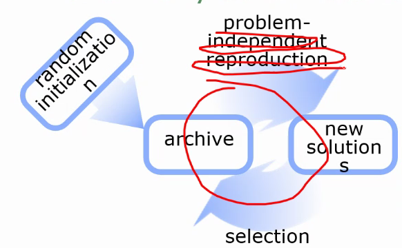

### 强化学习

- vs 有监督学习：有监督学习只从环境拿一次数据，RL 会不断和1环境交互
- state $s$
- action $a$
- decision $\pi(a|s)$
- reward $R(s,a,s')$

## MDP (Markov Decision Process)

### Markov Process

- 马尔科夫链：未来事件的发生只和当前状态有关
- 状态 $s$

### Markov Decision Process

- 在马尔可夫过程的基础上增加了 reward：转移的时候会有权值 $R(s,a,s')$
- policy 的权值是多少？
  - state value function $V^\pi(s)=E[\sum_{t=1}^Tr_t|s]$
  - state-action value function $Q^\pi(s,a)=E[\sum_{i=1}^Tr_t|s,a]=\sum_{s'}P(s'|s,a)(R(s,a,s')+V^\pi(s'))$

### 怎么算

## 强化学习

- model based：学 R 和 P，然后解 mdp
- model free：直接学策略
- 蒙特卡洛方法
  - 就是采样出整条完整的路径

### 连续状态

## Derivative-free 优化

- 例如演化算法
  - reproduction 和环境无关，selection 和环境有关

## 深度强化学习

- deep learning：适合处理图像：
  - 单独的小区域没什么意义（比如图像的一个像素
  - 只有考虑了总体才会有意义
- Deep Q-Network (DQN)
  - ε-greedy
  - replay memory
  - mini-batch
- 强化学习还没有成熟
  - 应用时的难点：收敛太慢，短期回报下降
  - 实机上应用很狭窄，需要大量的数据（以百万计

### shaping rewards

- 给 rewards 加权求和，可以调整学习的目标
- 主要 rewards、辅助（auxiliary）rewards

### Simulator

- 在真实世界训练代价太大
- 决策智能落地门槛：零试错

### 虚拟淘宝