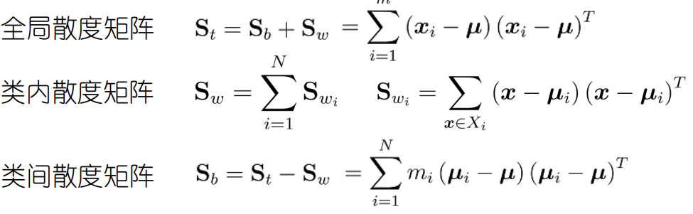

## 1. 绪论

- 推理期 1956 - 1960 => 知识期 1970 - 1980 => 学习期 1990 - now
- ==PAC, Probably Approximately Correct== 概率近似正确定理
	- $P(|f(x)-y|\le\epsilon)\ge 1-\delta$
- ==NFL, No Free Lunch==

## 2. 模型的评估与选择

### 经验误差与过拟合

- 错误率、精度
- 训练误差（经验误差，训练集上的），泛化误差（新样本上的）

### 评估方法

#### 留出法

- 直接将数据集划分为两个互斥的集合
- 要求：
	- 保持数据分布一致性（分层采样
	- 若干次随机划分、重复进行实验评估后取平均值
	- 训练集不能太大也不能太小

#### 交叉验证法

- 将 D 划分为 k 个大小相似的互斥子集（分层采样），用 k-1 个训练，1 个测试
- k 个结果取平均值
- k 折交叉验证
	- 常用值 k = 10
	- p 次 k 折交叉验证：就是随机划分 p 次
	- 令 k = m（m 默认为数据数量）：留 1 法==（LOO，Leave-One-Out）==

#### 自助法

- 在 D 中有放回抽样 m 次，得到 D'，用 D' 训练，$D\backslash D'$ 测试
	- 极限情况 D' 约占 $\frac{1}{e}=36.8\%$
	- 包外估计
- 数据集较小、难以划分训练/测试集时有帮助
- 改变了数据分布，会引入估计偏差

#### 调参

- 调过参后用要用训练集+验证集重训练模型
- 验证集：选择模型和调参的时候用

### 性能度量

- 均方误差

#### 错误率与精度

#### 查准率、查全率、F1

- 混淆矩阵（confusion matrix）

| 真实\\预测 | +   | -   |
| :-: | :-: | :-: |
| +   | TP  | FN  |
| -   | FP  | TN  |

- 查准率（P，Precision）$P=\frac{TP}{TP+FP}$ 预测为真中实际为真
	- 查全率（R，Recall）$R=\frac{TP}{TP+FN}$ 实际为真中预测为真
- P-R 曲线
	- 平衡点 ==BEP, Break-Even Point==：P=R 的点
	- $\frac{1}{F1}=\frac{1}{2}\left(\frac{1}{P}+\frac{1}{R}\right)$
	- $\frac{1}{F_\beta}=\frac{1}{1+\beta^2}\left(\frac{1}{P}+\frac{\beta^2}{R}\right)$
- 多个混淆矩阵：
	- 宏查准/全率：macro-$P=\frac{1}{n}\sum_{i=1}^n P_i$，R 类似，然后再按上面计算 macro-$F1$
	- 微查准/全率：micro-$\displaystyle P=\frac{\overline{TP}}{\overline{TP}+\overline{FP}}$，R 类似，然后按上面计算 micro-$F1$

#### ROC & AUC

- ==ROC, Receiver Operating Characteristic==
	- 纵轴：真正例率 ==TPR, True Positive Rate== = TP / (TP + FN)
		- 预测对的正样本 / 所有正样本
	- 横轴：假正例率 ==FPR, False Positive Rate== = FP / (TN + FP)
		- 预测错的负样本 / 所有负样本
	- 画图：
		- 先假设全是反例，此时是（0，0）
		- 然后将分类阈值依次设为每个样例的预测值
		- 设前一个点坐标 $(x,y)$，当前若为真正例，则为 $(x,y+\frac{1}{m^+})$，若为假正例，则为 $(x+\frac{1}{m^-},y)$
- ==AUC, Area Under ROC Curve== = $\frac{1}{2}\sum_{i=1}^{m-1}(x_{i+1}-x_i)(y_{i}+y_{i+1})$
	- 排序损失 $\ell_{rank}=\frac{1}{m^+m^-}\sum_{\vx^+\in D^+}$

#### 代价敏感错误率

### 比较检验

#### 假设检验

- 先算出标准分布的拒绝域，然后反推回去

#### 交叉验证 t 检验

- k 折验证，求差 $\Delta_i$ 的均值和方差
- 检验枢轴量 $\displaystyle\tau_t=|\frac{\sqrt{k}\mu}{\sigma}|\sim t_{k-1}$
- 5 $\times$ 2 交叉验证

#### McNemar 检验

- 基于列联表，卡方检验

#### 多个学习器检验

- 先 Friedman 再 Nemenyi 后续检验
- Friedman：基于排序，F 分布，检查是否都相同
- Nemenyi：如果不是都相同，再后续检验，基于序值

### 偏差 - 方差分解

- 偏差：算法本身拟合能力
- 方差：拟合程度 / 数据扰动的影响（拟合程度越高，数据扰动影响越大，不矛盾
- 噪声：问题本身的难度
- 偏差 - 方差窘境

## 3. 线性模型

### 线性回归

- 没有序关系要用独热编码
- $2X^T(X\hat w-y)=0$
	- $X^TX$ 满秩/正定，则 $\hat w^*=(X^TX)^{-1}X^Ty$
- 广义线性模型 $g(y)=w^Tx+b$
	- g：联系函数

### 对数几率回归（实际上是分类

- $y=\frac{1}{1+e^{-z}}$
	- 反函数为联系函数 $g(y)=\ln\frac{y}{1-y}=\ln\frac{P[y=1\mid x]}{P[y=0\mid x]}$
- 极大似然估计，最后用梯度下降 / 牛顿法求目标函数

#### 线性判别分析

- ==LDA, Linear Discriminant Analysis==
	- ==FDA, Fisher ...==
- 第 i 类在直线 w 上投影的均值 $w^T\mu_i$ 方差 $w^T\Sigma_i w$
- $\max \displaystyle J=\frac{w^T(\mu_0-\mu_1)(\mu_0-\mu_1)^Tw}{w^T(\Sigma_0+\Sigma_1)w}=\frac{w^TS_bw}{w^TS_ww}$
	- 广义瑞利商
	- 求解：分母 = 0 最大化分子，拉格朗日乘子法 $S_bw=\lambda S_ww$, 因为 $S_bw$ 和 $\mu_0-\mu_1$ 共线（看表达式），所以 $S_bw=\lambda(\mu_0-\mu_1),w=S_w^{-1}(\mu_0-\mu_1)$
	- 计算：奇异值分解
- 多分类
	- 随便选两个，最后都会化成 $S_bW=\lambda S_wW$ 类似的形式
	- 解是 d' 个最大特征值，d' <= N-1，证明？（bounded by rank($S_b$)

### 多分类学习

- ==OvO, OvR, MvM==
- ==ECOC, Error Correcting Output Codes, 纠错输出码==
	- 每个类有个 pattern，看和哪个类最接近

### 类别不平衡

- 再缩放 $\displaystyle\frac{y'}{1-y'}=\frac{y}{1-y}\times \frac{m^-}{m^+}$，但是很难估计 $m^-,m^+$
	- 代价敏感（将两个类别的数量看成代价
- 三类：
	- 欠采样：EasyEnsemble
	- 过采样：==SMOTE, Synthetic Minority Oversampling Technique==
		- 插值构造额外的例子
	- 阈值移动

## 4. 决策树

- 如果选择某一个属性后，属性上某个值没有样本，则使用父节点最多的标记当作这个节点的标记

### 划分选择

#### 信息增益

- ==ID3, Iterative Dichotomiser 3==
- Gain = $Ent(D)-\sum\limits_{v=1}^V\frac{|D^v|}{|D|}Ent(D^v)$ 分类前 - 分类后（熵是混乱程度，降低了

#### 增益率

- C4.5
- Gain_ratio(D, a) = Gain(D, a) / IV(a), 固有值 IV(a) = $-\sum\limits_{v=1}^V\frac{|D^v|}{|D|}\log_2\frac{|D^v|}{|D|}$
- 为了平衡属性越多熵越小的 bug

#### 基尼系数

- ==CART, Classification And Regression Tree==
- Gini(D) = $1-\sum\limits_{k=1}^{|Y|}p_k^2$
	- 随机选两个，类别不一样的概率
	- 越低越纯
- 属性的 Gini_index 就是所有取值的加权平均，选最低的

### 剪枝

- 预剪枝、后剪枝
- 用验证集进行

### 连续值和缺失值

#### 连续值（不是回归

- 连续属性离散化：二分法，n 个值有 n - 1 种划分，看成 n - 1 个属性值

#### 缺失值

- $\rho,\tilde p_k,\tilde r_v$
- 将样本以不同概率划分到不同的子节点中去

### 多变量决策树

- 轴平行
- [ ] 去算几个

## 5. 神经网络

### 感知机和多层网络

- 感知机：输出层是 M-P 神经元（好像就是普通的？
	- 只能解决线性可分问题
	- ==MLP, Multi-Layer Perceptron==
	- ==CNN, Convolutionary Neural Network==
- 多层前馈神经网络

### 误差逆传播算法

- [ ] 算一遍
- 万有逼近性：多层前馈网络能以任意精度逼近任何复杂度的连续函数
- 标准 ==BP, Back Propagation==：每个数据都更新一遍
	- 累积 BP：计算完整个数据集的误差再更新一遍
- 防止过拟合：
	- 早停：验证集误差上升就停止
	- 正则化：误差中增加一项描述复杂度
- 跳出局部极小：
	- 多组不同初始值
	- 模拟退火 / 随机扰动
	- 随机梯度下降
	- 遗传算法
- 其它神经网络
	- ==RBF, Radial Basis Function==
	- ==ART, Adaptive Resonance Theory==
	- ==SOM, Self-Organizing Map==
	- 级联相关网络
	- ==RNN, Recurrent Neural Network==
	- Bolzman 机

### 深度学习

- 训练 trick
	- 预训练 + 微调：每次只训练一层
	- 权共享：==CNN, Convolutionary Neural Network== 中用的多，每一层连接权都一样
	- Dropout：每次只更新部分参数，增加问题难度和泛化能力
	- ==ReLU, Rectified Linear Unit==：缓解梯度消失现象
	- 用交叉熵作损失函数 $-\frac{1}{m}\sum\limits_{i=1}^my_i\log y_i$：分类问题有用

## 6. 支持向量机

### 对偶问题

- ==SVM, Support Vector Machine==
- 原问题和对偶问题都要满足 KKT 条件中和不等式
- 求解方法：==SMO, Sequential Minimal Optimization==
	- 每次选取违背 KKT 最大的 $\alpha_i$，再选间隔最大的 $\alpha_j$
	- 只将这两个当变量 $\alpha_iy_i+\alpha_jy_j=c$
- b 的确定
	- 通过任意支持向量 $y_sf(x_x)=1$ 解
	- 通常取所有支持向量解的平均

### 核函数

- 在 $\boldsymbol x$ 外面套一个 $\phi(\boldsymbol x)$
- 核函数 $\kappa(x_i,x_j)=\phi^T(x_i)\phi(x_j)$
- 核函数 $\iff$ 核矩阵半正定
- ==RBF, Radial Basis Function== 高斯核别称

### 软间隔 & 正则化

- hinge loss: $\max\{0,1-z\}$
- 令上式直接变成松弛变量 $\xi$，只需引入两个约束：$z\ge 1-\xi,\xi>0$
- 正则化：$\min\Omega(f)+C\sum\limits_{i=1}^m\ell(f(x_i),y_i)$ 结构风险 + 经验损失

### 支持向量回归

- ==SVR==
- 损失函数是 $\epsilon$ 不敏感损失
	- = 0 if < $\epsilon$
	- else = |loss| - $\epsilon$

### 核方法

- ==RKHS, Reproducing Kernal Hilbert Space== 再生核希尔伯特空间
- 表示定理：任意正则化优化问题的解总可以写为核函数 $\kappa(x,x_i)$ 的线性组合

## 7. 贝叶斯分类器

### 贝叶斯决策论

- 贝叶斯最优分类器、贝叶斯风险：学习的理论上限
- 判别式：直接求 P(c|x)；生成式：先求联合分布

### 极大似然估计

- ==MLE. Maximum Likelihood Estimation==
	- $h_{nb}=\arg\max_cP(c)\prod_{i=1}^dP(x_i\mid c)$
- $P(x\mid\theta)$：可以理解为在 $\theta$ 参数下 x 的分布
- 严重依赖于所假设的概率分布形式
- [ ] 最大后验估计

### 朴素贝叶斯分类器

- 属性条件独立假设 $P(\boldsymbol x\mid c)=\prod\limits_{i=1}^dP(x_i\mid c)$
- $h_{nb}=\arg\max_cP(c)\prod_{i=1}^dP(x_i\mid c)$
- 训练：$P(c)=\frac{|D_c|}{|D|}$, $P(x_i\mid c)=\frac{|D_{c,x_i}|}{|D_c|}$
- 拉普拉斯修正：每个类加一个虚拟的样本

### 半朴素贝叶斯分类器

- 独依赖估计 ==ODE, One-Dependent Estimator==：最多依赖一个属性（父属性
- 如何确定父属性
	- ==SPODE, Super-Parent ...==：全依赖同一个
	- ==TAN, Tree Augumented naive Bayes==：以属性间的条件互信息为边权跑 MST
	- ==AODE, Averaged ...==，尝试将每个属性作为超父，然后只集成数据够多的`

### 贝叶斯网

- $B=<G,\Theta>$
	- G：==DAG, Directed Acyclic Graph==
	- $\Theta$：条件概率表 ==CPT, Conditional Probability Table==
		- 每个节点，定量描述依赖关系（就是联合分布表？
- 每个属性和非后裔属性独立，网络的似然长得类似于 P(x1,x2,x3,x4) = P(x1) P(x2) P(x3|x1) P(x4|x_1,x_3)
	- x3、x4在给定 x1 取值时独立：$x_3\bot x_4\mid x_1$
- 三种结构：同父、冲撞、顺序
	- V 型结构（冲撞结构）中，如果共同子节点的值不确定，则两个父亲也是独立的，否则不是
	- 边际独立性 $x_1\coprod x_2$
	- 判断条件独立性：有向分离，V 型加条边，全转成无向边
	- 如果去掉一个集合 $\boldsymbol z$ 后 x y 不相连，则 $x\bot y\mid\boldsymbol z$

#### 学习

- ==MDL, Minimum Description Length==
- s(B|D) = f($\theta$)|B|- LL(B|D)
	- ==AIC, Akaike Information Criterion== f($\theta$)=1
	- ==BIC, Bayesion Information Criterion== $f(\theta)=\frac{1}{2}\log m$

#### 推断

- ==EM, Expectation Maximization==
- E 步：计算隐变量的期望
- M 步：最大化参数的对数似然

## 8. 集成学习

### Boosting

- AdaBoost
	- 最小化指数损失函数 $\ell(H\mid D)=\mathbb E_{x\sim D}[e^{-f(x)H(x)}]$
- 降低偏差

### Bagging

- ==Bag, Bootstrap Aggregate==
	- boostrap 搞一堆数据集的子集，每个学，学完投票
- ==RF, Random Forest==
	- 除此之外还随机选择属性，选一个有 k 个属性的集合
- 降低方差

### 结合策略

- 统计方面：训练集上可能多个假设性能相同，但只有一个真的
- 计算方面：避免陷入局部极小
- 表示方面：扩展表示空间（可能假设空间不是凸的（？

#### 平均法

#### 投票法

#### 学习法

- Stacking：将上一个学习器的输出当输入，标签当输出训练下一个学习器
	- 可以认为初级学习器提供了更好的特征

### 多样性

#### 误差 - 分歧分解

- 集成错误率 = 平均错误率 - 分歧
	- 第 i 个学习器的分歧 $A(h_i\mid x)=(h_i(x)-H(x))^2$
	- 整体分歧就是加权求和

#### 多样性度量

- 列联表
	- 不合度量
	- 相关系数
	- Q-统计量
	- $\kappa$-统计量 = $\frac{p_1-p_2}{1-p_2}$
	- ……

### 多样性增强

- 数据样本扰动：选不同数据子集，对不稳定学习器（决策树、NN）有效
- 输入属性扰动
- 输出表示扰动：ECOC
- 算法参数扰动

## 9. 聚类

### 性能度量

- 外部指标：和某个参考模型比较
- 内部指标
- 簇内相似度高，簇间相似度低

### 距离计算

- 有序属性：非负，同一，对称，直递（三角不等式）
- 无序属性：==VDM, Value Difference Metric== VDM$\displaystyle _p(a,b)=\sum\limits_{i=1}^k|\frac{m_{u,a,i}}{m_{u,a}}-\frac{m_{u,b,i}}{m_{u,b}}|$
	- 用样本簇中的占比代替取值
- 混合属性：MinkovDM（就是有序的用闵可夫斯基，无序的用 VDM）、加权距离

### 原型聚类

- 聚类特征可以被原型刻画

#### k 均值算法

- 目标：最小化平方误差 $\sum\limits_{i=1}^k\sum\limits_{x\in C_i}\|x-\mu_i\|^2$

#### 学习向量量化

- ==LVQ, Learning Vector Quantization==
- 有监督，用标记辅助聚类
	- 找出最近的原型，如果标记相同则拉近，否则推远
	- 每个数据属于最近的原型：Voronoi 剖分

#### 高斯混合聚类

### 层次聚类

#### AGNES

- AGglomerative NESting
- 合并果子

## 10. 降维

### PCA

- z_i 坐标，w_i 基，x_i 实际位置
- 最近重构性 最大可分性