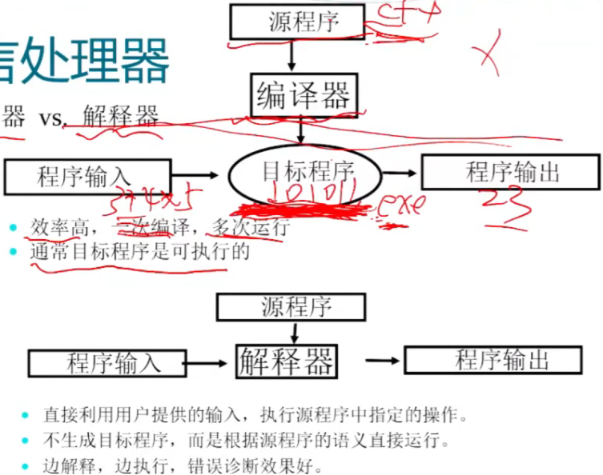
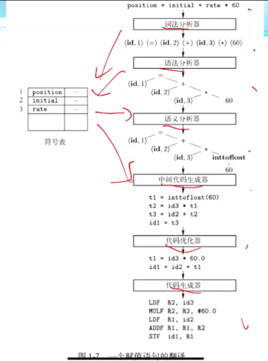

- 作业两周一次

- 什么是编译器
  - 输入一种语言，输出另一种语言，语义等价；有错报错
  - 狭义：程序设计语言 -> 机器代码，这门课就讲这个
- 编译器 vs. 解释器
- 编译器结构
  - 分析部分
    - 源程序 -> 语法结构 -> 中间表示，生成符号表，分析错误
    - 编译器的前端
  - 综合部分
    - 符号表 & 中间表示 -> 目标程序
    - 编译器的后端
  - 
  - 词法分析：基于词素产生词法单元，输出一堆 tuple <token-name, attribute-value>
  - 语法分析：搞出语法树
  - 语义分析：语言定义的语义约束、检查类型信息、类型转换
  - 中间代码生成：三地址代码，每个指令最多包含三个运算分量
  - 优化，代码生成
  - 趟的概念
- 构造工具
  - 扫描器生成器 lex/flex
  - 语法分析器生成器 yacc/biison
  - ……
- 程序设计语言